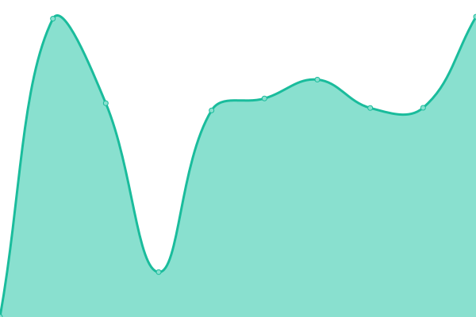

# [📈 Live Status](https://itbm-services.github.io/projects): <!--live status--> **🟧 Partial outage**

This repository contains the open-source uptime monitor and status page for [ITBM](https://itbm-services.github.io/projects), powered by [Upptime](https://github.com/upptime/upptime).

With [Upptime](https://upptime.js.org), you can get your own unlimited and free uptime monitor and status page, powered entirely by a GitHub repository. We use [Issues](https://github.com/itbm-services/projects/issues) as incident reports, [Actions](https://github.com/itbm-services/projects/actions) as uptime monitors, and [Pages](https://itbm-services.github.io/projects) for the status page.

<!--start: status pages-->
<!-- This summary is generated by Upptime (https://github.com/upptime/upptime) -->
<!-- Do not edit this manually, your changes will be overwritten -->
<!-- prettier-ignore -->
| URL | Status | History | Response Time | Uptime |
| --- | ------ | ------- | ------------- | ------ |
|  [ITBM WebSite](https://itbm.mx) | 🟩 Up | [itbm-web-site.yml](https://github.com/itbm-services/projects/commits/HEAD/history/itbm-web-site.yml) | 

 3124ms
     
 | 

<a href="https://itbm-services.github.io/projects/history/itbm-web-site">56.04%</a>
    

|  [GPTW MX](https://greatplacetowork.com.mx) | 🟩 Up | [gptw-mx.yml](https://github.com/itbm-services/projects/commits/HEAD/history/gptw-mx.yml) | 

 739ms
     
 | 

<a href="https://itbm-services.github.io/projects/history/gptw-mx">100.00%</a>
    

|  [GPTW CARCA](https://greatplacetoworkcarca.com/es) | 🟩 Up | [gptw-carca.yml](https://github.com/itbm-services/projects/commits/HEAD/history/gptw-carca.yml) | 

 1612ms
     
 | 

<a href="https://itbm-services.github.io/projects/history/gptw-carca">98.56%</a>
    

|  [Impulso Humano](https://impulsohumano.org) | 🟥 Down | [impulso-humano.yml](https://github.com/itbm-services/projects/commits/HEAD/history/impulso-humano.yml) | 

 0ms
     
 | 

<a href="https://itbm-services.github.io/projects/history/impulso-humano">0.00%</a>
    

|  [ULINEA](https://ulinea.edu.mx) | 🟩 Up | [ulinea.yml](https://github.com/itbm-services/projects/commits/HEAD/history/ulinea.yml) | 

 237ms
     
 | 

<a href="https://itbm-services.github.io/projects/history/ulinea">100.00%</a>
    

|  [Lucy Meza](https://lucymeza.si) | 🟥 Down | [lucy-meza.yml](https://github.com/itbm-services/projects/commits/HEAD/history/lucy-meza.yml) | 

 0ms
     
 | 

<a href="https://itbm-services.github.io/projects/history/lucy-meza">100.00%</a>
    

|  [GCTI](https://greatculturetoinnovate.org) | 🟥 Down | [gcti.yml](https://github.com/itbm-services/projects/commits/HEAD/history/gcti.yml) | 

 1176ms
     
 | 

<a href="https://itbm-services.github.io/projects/history/gcti">51.02%</a>
    

<!--end: status pages-->

[**Visit our status website →**](https://itbm-services.github.io/projects)

## 📄 License

- Powered by: [Upptime](https://github.com/upptime/upptime)
- Code: [MIT](./LICENSE) © [ITBM](https://itbm-services.github.io/projects)
- Data in the `./history` directory: [Open Database License](https://opendatacommons.org/licenses/odbl/1-0/)
